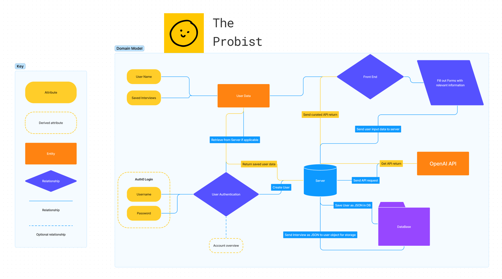
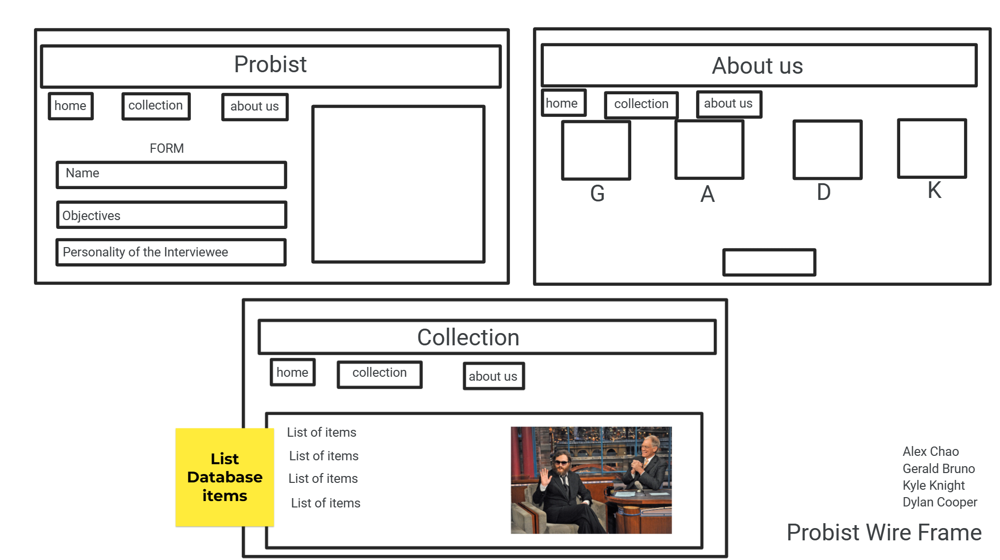

# Probist-BE

**Author**:

Alex Chao
Kyle Knight
Gerald Bruno
Dylan Cooper

**Version**: 1.0.0 (increment the patch/fix version number if you make more commits past your first submission)

## Overview

InterviewIQ is an AI-powered platform that empowers journalists by providing them with a comprehensive framework to conduct impactful interviews. Journalists can input key information and context about the interviewee and the topic, and InterviewIQ generates a tailored list of insightful and probing questions. The platform ensures that interviewers are well-prepared, equipped with relevant information, and able to ask thought-provoking questions that uncover the truth.

## Getting Started

[Presentation Doc](https://docs.google.com/presentation/d/1NeXKKEpjK2DDme8EwlZBsJndUqIgGYzWrY6FAYtNTf0/edit?usp=sharing)

MVP:

1. User Interface (UI): A functional and intuitive web-based interface for journalists to input interviewee details, topic context, and any specific parameters for the interview.

2. Question Generation: The AI-powered question generation system that analyzes the inputted information and generates a list of thought-provoking questions. The questions should be relevant, targeted, and designed to elicit informative responses.

3. Interview Preview: The ability for journalists to preview and customize the generated questions before conducting the interview. This allows them to fine-tune the list, add their own questions, or modify the sequence as needed.

4. Interviewee Profile Management: Basic functionality to manage interviewee profiles, including storing and retrieving information for future reference.

By delivering these core features, InterviewIQ's MVP showcases its key value proposition of assisting journalists in preparing impactful interviews and facilitating deeper insights from interviewees.

## CRUD

CREATING - Post - Template for the Interview, to include interviewer (and style?) interviewee, subject, and any other inputs in initial prompt to be saved for re-use to change parameters or add additional data hoping for new output

READ - Get - Pull response from API with query.
UPDATE - Put - Allow update of interview template

DELETING - Delete - Delete interview template

## User Stories

[Trello Board](https://trello.com/b/EMLQBr5Q/the-probist)

### 1

Title: **__Assistant New Anchor__**
User Story:
As a user of the AI interview helper, I want to be able to select the role of the interviewer, so that I can practice and prepare for interviews with specific individuals in real life.
Feature Tasks:
Implement a dropdown or selection interface to choose the desired role of the interviewer.
Provide a form that takes in the interviewer information
Customize the AI interview helper's responses and behavior based on the selected interviewer role(s).
Ensure that the interviewer role information is intuitive and easy to use, with clear instructions and options.
Acceptance Tests:
Verify that the form interface for selecting the interviewer role is displayed prominently and is easy to navigate for users.
Test the form by inputting different roles and interviewer information, and confirm that the inputs are captured accurately.
Validate that the AI interview helper's responses and behavior adapt according to the selected interviewer role and the associated information from the form.
Confirm that the selected interviewer role and associated information are stored and retained throughout the practice session, allowing consistent interview simulations.

### 2

Title: **__Interview Prep__**
User - feature - Realistic Interviewee Responses
User Story:
As an interviewee using the AI interview helper, I want the system to provide realistic responses based on the selected interviewer role, so that I can simulate realistic interview scenarios and improve my interview skills.
Feature Tasks:
Use of AI for potential interview questions and corresponding responses for different interviewer roles.
Implement logic to analyze the selected interviewer role and generate appropriate responses for each question.
Incorporate natural language processing techniques to ensure coherent and contextually relevant interviewee responses.
Enhance the system's understanding of the interviewee's context, experience, and qualifications to generate more personalized responses.
Continuously update and expand the database of interview questions and responses to cover a wide range of scenarios.
Acceptance Tests:
Validate that the AI interview helper provides responses that align with the selected interviewer information's expected behavior and communication style.
Test the system with different interview prompts and confirm that it generates relevant and coherent responses.
Ensure that the responses reflect the interviewee's qualifications, experience, and context accurately, adding a sense of authenticity to the simulation.
Verify that the AI interview helper handles different types of questions effectively, such as behavioral questions, technical questions, or situational inquiries.

### 3

Title: **__Mock questioning__**
User - Feature - Prompt Information & Conversation History
User Story sentence:
As a user, I want to see past conversations so I could see the prompt information template, so that I have a better understanding of how the tone of the interview is going to be conducted.
Feature Tasks:
Add a "Past Conversations" section to the user interface, where users can view their previous conversations.
Implement a database or storage mechanism to store and retrieve past conversation data.
Display the conversation details in a clear and organized manner, including the prompt information template and any relevant metadata (such as date and time of the conversation).
Provide a search or filter functionality to allow users to easily find specific conversations based on keywords, dates, or other relevant criteria.
Ensure that the "Past Conversations" section is accessible and visible to the user at all times.
Acceptance Tests:
Verify that the "Past Conversations" section is added to the user interface and is easily accessible from the main menu or navigation bar.
Test that when a user clicks on a specific conversation from the "Past Conversations" section, the conversation details, including the prompt information template, are displayed correctly.
Ensure that the conversation details include relevant metadata such as the date and time of the conversation.
Test the search or filter functionality by entering specific keywords or dates and verifying that the relevant conversations are displayed accordingly.
Verify that the "Past Conversations" section remains visible and accessible to the user regardless of their actions within the application (e.g., navigating to other sections or refreshing the page).

### 4

Title: **__Login__**
Authorized user
User Story:
As an authorized user, I want to securely authenticate myself and have appropriate access rights, so that I can ensure the confidentiality and integrity of my information within the AI interview helper.
Feature Tasks:
Implement a user authentication system to securely verify user credentials, such as username and password.
Incorporate industry-standard encryption protocols to protect user login information during transmission and storage.
Develop user roles and permissions, such as administrator, manager, or interviewee, to manage access rights within the AI interview helper.
Assign appropriate access privileges to each user role, allowing authorized users to perform specific actions and access relevant features.
Implement authorization checks at the application level to ensure that users can only access and modify data that they are authorized to handle.
Acceptance Tests:
Verify that the user authentication system is in place and allows users to securely log in with valid credentials.
Test the encryption mechanisms to ensure the confidentiality and integrity of user login information during transmission and storage.
Validate that user roles and permissions are implemented correctly and reflect the intended access rights for each role.
Confirm that authorized users can access and perform actions based on their assigned user roles and permissions.
Conduct thorough security testing to ensure that authorization checks prevent unauthorized access to sensitive data or functionalities within the AI interview helper.

### 5

Title: **__Help Wanted__**
Job Seeker - Feature Adapting to Different Interview Dynamics

User Story Sentence: As a job seeker, I want the AI interview helper to offer a variety of interviewer roles, including different personalities and communication styles, so that I can practice adapting to different interview dynamics and increase my chances of success in real-life interviews.

Feature Tasks:

Design and implement a system that allows job seekers to choose from a variety of interviewer roles, each with distinct personalities, communication styles, and interview approaches.
Develop a database or storage mechanism to store the characteristics and attributes associated with each interviewer role.
Incorporate AI algorithms that simulate different interview dynamics based on the selected interviewer role, such as their tone of voice, questioning style, level of friendliness, or level of formality.
Enable job seekers to switch between different interviewer roles during practice sessions to experience a range of interview scenarios and challenges.
Provide feedback and suggestions to job seekers on how to adapt their responses, communication style, and overall approach based on the specific interviewer role they encounter.

Acceptance Tests:

Verify that the AI interview helper interface includes a selection mechanism or menu that allows job seekers to choose from a variety of interviewer roles.
Test the system by selecting different interviewer roles and validating that the simulated interview dynamics reflect the chosen characteristics and attributes.
Ensure that the AI algorithms accurately simulate different communication styles, tones, and questioning approaches associated with each interviewer role.
Validate the ability to switch between different interviewer roles seamlessly during practice sessions without any technical issues or disruptions.
Assess the feedback and suggestions provided by the AI interview helper, ensuring that they offer practical advice on adapting responses, communication styles, and overall interview strategies based on the specific interviewer role.
Seek user feedback and conduct surveys to evaluate the effectiveness of practicing with different interviewer roles in helping job seekers adapt to diverse interview dynamics and increase their chances of success in real-life interviews.

## Vision

with a comprehensive framework that streamlines the interview preparation process, generates insightful questions, and facilitates the discovery of valuable insights. By providing journalists with a tool that enhances their interviewing skills and enables them to uncover the truth

## Pain Point addressed

Interviewing is a critical part of Journalism. It can be time consuming and difficult to prepare impactful questions that are just as effective. By generating questions it streamlines that process and helps people overcome the obstacle of asking the right questions. 

## Reasons to care

Efficiency for time and finding the questions for a certain scenario
Skill development in speaking and asking questions.
Understanding the mindset of the interviewee.

## Scope

### In’s - What will our app do?

Take in prompt information about the interviewer and interviewee
Interviewee profile management with an updating feature
See a list of old interviews(past conversation)
Provide some insights on the interviewee
Save

### Out’s - What our app will not do?

This app should be able to provide Q&A of an interview.
It will not offer career coaching services.
Our app will not provide job search functionalities or employment information.

### What will your MVP functionality be?

Users can input the role of the interviewer from a form to customize their interview experience.
The AI interviewer will generate interview questions based on the input from users.

## What are your stretch goals?

Enhance the functionality and effectiveness of the interview AI, offering a more personalized feedback.
Developing an algorithm with a diverse range of interviewer styles.
The AI analyzes data and provides feedback.

## Domain Model



## Wire Frame



## Schema

```{
  "$schema": "http://json-schema.org/draft-04/schema#",
  "$id": "https://theprobist.com/interview.schema.json",
  "title": "Interview",
  "description": "This schema represents an interview with a person.",
  "type": "object",
  "properties": {
    "person": {
      "description": "The person being interviewed.",
      "type": "string"
    },
    "interviews": {
      "description": "A collection of interviews with the person.",
      "type": "array",
      "items": {
        "type": "object",
        "properties": {
          "goal": {
            "description": "The goal or topic of the interview.",
            "type": "string"
          },
          "questions": {
            "description": "The list of questions asked during the interview.",
            "type": "array",
            "items": {
              "type": "object",
              "properties": {
                "question": {
                  "description": "The text of the question.",
                  "type": "string"
                },
                "response": {
                  "description": "The response provided by the interviewee.",
                  "type": "string"
                }
              }
            }
          }
        }
      }
    }
  }
}```
